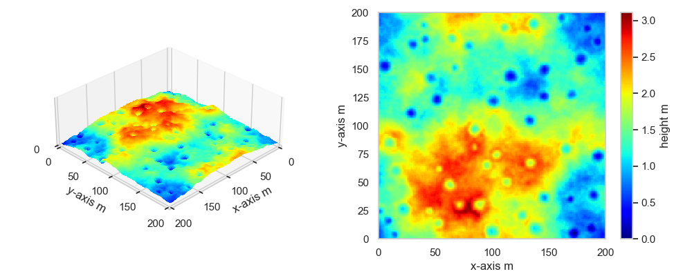

# Lunar surface topographic map

**lstm** is a library to generate lunar surface topographic map with Python.

# Overview

This library aims to generate simulated lunar environments according to fidelity conditions such as terrain roughness and crater forms.
The environments are expressed as x- and y-axis grid map containing height information. I'm writing this library to exploit it 
for the purpose of planning and navigation studies, so that some useful features (e.g. conversion of continuous from/to discrete space) are implemented.
Currently, I'm still on the way of implementing this library. If you have any questions, please let me know!

# Requirements
 
* Python 3.9.10
 
Environments under venv on Mac OS is tested. I recommend to use virtual environments for this library.

# Tutorials
You can install necessary libraries by running following commands.

```bash
pip install -e .
```

Then, you can see how to make lunar simulated environments by running `scripts/create_map.py`.
2.5 and 2D colored images with height information can be seen as follows.


 
# TODO

* Terrain randomness will be implemented considering the actual lunar terrain surface.
* Crater distribution will be implemented according to the actual lunar terrain surface.
 
# Author
 
* Masafumi Endo, Ph.D. student@Keio University working on robotic autonomy for planetary exploration rovers
* [personal website](https://www.masafumiendo38.com/)
